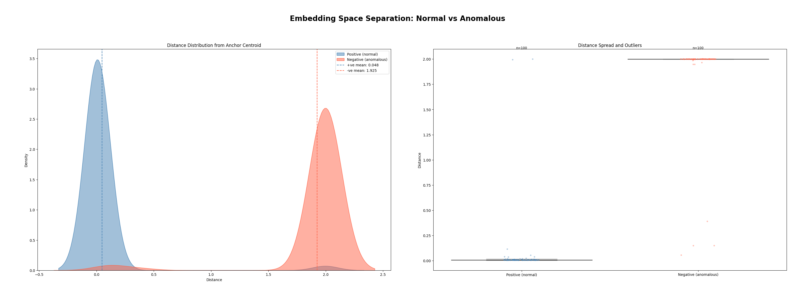

# Anomaly Detection
## Overview

The aim of this project is to apply deeplearning principles to detect
anomalies from logs.

To identify if a single log line from an application or system
indicates an error condition is quite straightforward. The log line
will likely have a field indicating the severity of the log along with
some description. However detecting if a set of log lines indicate an
anomaly involves looking at multiple log lines, discerning patterns
from them and then arriving at a conclusion if these pattern(s) look
abnormal.

The principles of deeplearning can be applied look for patterns across
multiple lines and detect anomalous patterns.[CNNs](https://en.wikipedia.org/wiki/Convolutional_neural_network) are
widely used for tasks like image recognition and [Siamese neural
network](https://en.wikipedia.org/wiki/Siamese_neural_network) are
used for tasks like signature verification. [Curriculum learning](https://en.wikipedia.org/wiki/Curriculum_learning) is a technique
used to train model on examples of increasing difficulty. This project makes use of
CNN, Siamese neural network and Curriculum learning to detect anomalies from logs.

A triplet of synthetic logs: _anchor_, _positive_, and _negative_ logs
are generated. The model is trained on these logs with training
examples getting progressively harder as the training progresses. The
validation metrics of the model is calculated based on separate set of
triplets that are not seen during the training.

A set of golden rations are generated from the samples in the
validation set and are stored. During the inference the user would
provide a set of logs and these logs in batches are compared against
the golden ratios and the trained model calculates the probability
of the batch being anomalous. Any batch with anomalous probability >
0.5 is marked "abnormal".

## Model Training
### Synthetic data generation
To demonstrate the validity of this approach synthetic logs are
generated and the model is trained on these logs. The model and the
associated data ingestion pipeline can be modified to support
different kind of application or system logs.

The structure of the synthetic log is as below:
```
timestamp,component,level
1776862080.9411054,MMCS,INFO
1776862510.2804463,KERNEL,WARNING
1776862959.0126984,HARDWARE,WARNING
```

Each log line contains below fields:
- **timestamp**: epoch timestamp at which log was generated. the timestamp in the logs will be monotonically increasing.
- **component**: component (sub-system generating) the log. Possible values are: *APP*, *DISCOVERY*, *HARDWARE*, *KERNEL*, *MMCS*
- **level**: severity level of the log. Possible values are: *INFO*, *WARNING*, *ERROR*, *SEVERE*, *FATAL*

For the purpose of analysis a single line with severity of *SEVERE* or *FATAL* for a component is NOT considered abnormal.
For anomaly detection the logs are analyzed in batch of 10 and a batch is deemed abnormal if the below condition is met.

- In a batch within a span of <300 seconds there are two or more logs at level *SEVERE* or *FATAL* for the same component.

An example of abnormal log batch:
```
1776864000,HARDWARE,SEVERE # (Start)
1776864103,APP,INFO
1776864120,HARDWARE,FATAL # (Delta: 120s)
1776864171,MMCS,INFO
1776864172,HARDWARE,FATAL # (Delta: 52s)
1776864835,MMCS,INFO
1776864895,HARDWARE,INFO
1776864960,KERNEL,WARNING
1776865078,APP,WARNING
1776865153,HARDWARE,WARNING
```

The above batch is considered *ABNORMAL* since there are more than 2
logs for component *HARDWARE* with a time difference between any two
entries (at level *SEVERE/FATAL*) < 300 seconds. The model is
supposed to infer this batch as "abnormal" even though the batch has
log lines interspersed from multiple components.

The synthetic logs are generated by running the driver code (*main.py*)
with option _generate-dummy-logs_. It takes an argument _batch_count_
that indicates the number of batches of logs that needs to be
generated, with each batch having 10 logs.

`$ python src/main.py generate-dummy-logs 100`

### Training and Validation
While the model easily learns to classify the positive samples as normal, to
train it to mark negative samples as _abnormal_ is harder and we need
a higher level of _recall_ ratio (i.e.  minimising the number of anomalous batches incorrectly classified as normal)
along with an acceptable _precision_ level.
To that effect four sets of negative logs (*easy*, *medium*, *hard*, and
*extreme*) are generated with increasing level of difficulty. The model
is trained on easier negative samples during the initial training with
difficulty level of negative samples increasing with later epochs.
This approach to training is referred as _Curriculum learning_.

After each epoch the model is validated against the validation set which is not seen
by the model during the training. The negative samples in the validation set has a
higher proportion of negative samples drawn from the _hard_ and _extreme_ type of negative samples.

The following validation metrics are calculated at end of each epoch to measure the model performance.
The model checkpoint that achieves the best results across these metrics is saved:
- **Overlap Fraction**: Quantifies the percentage of anomalous (negative) samples 
  embedded within the normal (positive) cluster. A lower value indicates 
  superior class discrimination.
- **Separation Ratio**: Measures the margin between the mean distance of positive 
  samples from the anchor versus the mean distance of negative samples from 
  the anchor. A higher ratio indicates a better-defined decision boundary.

_Overlap fraction_ is used as primary metric to measure the model performance and once it hits its peak value
(say 0.0) the _Separation Ratio_ is used as the deciding factor.

Along with checkpointing the model that has the best validation
metrics, following parameters (called golden ratios) derived by
running the trained model against the validation dataset are saved.

- **Anchor Centroid**: Centroid of embeddings of anchor logs. Also referred as _golden Centroid_
- **mu**: mean of distance of embeddings of positive samples from the golden Centroid
- **sigma**: standard deviation of distance of embeddings of positive samples from the golden Centroid
- **threshold**: 99th percentile of distance of embeddings of positive samples from the golden Centroid
- **max**: maximum of distance of embeddings of positive samples from the golden Centroid

### Inference
During the inference the trained model is loaded from the saved model parameters and the golden ratios
(saved during the training) are loaded. The L2 norm of the distances of the embeddings of given batch
of logs is calculated against the loaded golden Centroid. The probability of batch of logs being anomlaous
is calculated using this L2 norm, loaded threshold, and loaded standard deviation. If the calculated probability
is >0.5 the batch of logs is marked as *ABNORMAL* else as *NORMAL*. The severity of the log being anomalous
is the standardized L2 norm of the distance of the log vis-a-vis golden Centroid.

## Model Performance & Environment

### Training Environment
- **OS**: Ubuntu 24.04
- **Hardware**: AMD Ryzen 9 7900X, NVIDIA RTX GPU (16GB VRAM)
### Dataset Configuration
- **Window Size**: 10 log lines per batch
- **Training Samples**: 10,000 triplets (_Anchor_, _Positive_). 4 sets of negatives samples (_easy_,_medium_, _hard_ and _extreme_)
  were used to progressively train the model with harder samples.
- **Validation Split**: Separate set of 1000 triplets (Anchor, Positive, Negative) that were not used for training.
- **Data Characteristics**: Strictly monotonic timestamps with realistic background noise gaps (10s–100s)
### Benchmarks
- Validation Metrics
  - **ROC AUC score**: 0.9957
  - **Overlap fraction**: 0.00
  - **Separation Ratio**: 23.537
  
Training took around ~307 seconds and training was done for 40 epochs. The training was done on AMD Ryzen 9 7900X, NVIDIA RTX GPU (16GB VRAM)
### Plots
  The distribution and spread of distances of positive and negative samples from the anchor Centroid generated by running
  the trained model against validation dataset is as below: 

## Usage
The project is developed using Python version: 3.14. `uv` is used to
manage the project dependencies. Run `uv sync` to update project
dependencies and install the necessary python packages. Alternatively
the project dependencies are specified in `requirements.txt` and can
be installed using `pip`.

```
$ python src/main.py --help
generate-dummy-logs  Generate synthetic logs. The logs will be generated under <project_root>/synthetic. Three sets of logs: anchors_(train|valid).csv, positives_(train|valid).csv,
                     and negatives_(train_[easy|medium|hard|extreme]|valid).csv will be generated. Size of each batch will be 10 and total number of log lines will be 10 * batch_count.
train-model          Train the model using the training and validation log samples available under <project_root>/synthetic. State of the trained model and
                     other learned parameters will be saved under specified state_root_dir, if one is specified. If no directory is specified the trained model state
                     and related configuration will be saved under <project_root>/saved_states.
infer                Run inference on the batch of logs contained in given file path. The inference will be run on batch of 10 logs at a time, and classification result will be on
                     each batch (of 10) logs. State of the trained model and other necessary parameter will be loaded from specified state_root_dir, if one is specified. If no directory
                     is specified the trained model state and related parameters will be loaded from <project_root>/saved_states.
show-plots           Generate and show Kernel Density Estimation (KDE) and box plots using the trained model. These models show distance spread and 
                     outliers of samples in validation dataset compared to the anchor Centroid.
```

### Sample invocations
**Model Training**
```
$ python src/main.py train-model

Starting Training and Validation
Validation metrics:{'roc_auc': 0.9268, 'pr_auc': 0.9387482297740568, 'overlap_fraction': np.float64(0.29), 'separation_ratio': np.float32(9.47956), 'pos_mean': np.float32(0.13704278), 'neg_mean': np.float32(1.2991054)}
  -> New best model saved to './saved_states/cnn_siamese/model.pth' with overlap fraction: 0.2900, separation ratio:9.4796

Validation metrics:{'roc_auc': 0.9529, 'pr_auc': 0.9552482215420361, 'overlap_fraction': np.float64(0.22), 'separation_ratio': np.float32(30.459227), 'pos_mean': np.float32(0.039963156), 'neg_mean': np.float32(1.2172471)}
  -> New best model saved to './saved_states/cnn_siamese/model.pth' with overlap fraction: 0.2200, separation ratio:30.4592
...
Validation metrics:{'roc_auc': 0.998, 'pr_auc': 0.9957556524659946, 'overlap_fraction': np.float64(0.0), 'separation_ratio': np.float32(23.537931), 'pos_mean': np.float32(0.0818026), 'neg_mean': np.float32(1.9254642)}
using separation ratio as criteria to save
  -> New best model saved to './saved_states/cnn_siamese/model.pth' with overlap fraction: 0.0000, separation ratio:23.5379

Training and Validation complete. Took 306.8501350879669 seconds
 Best model saved to './anomaly_detection/saved_states/cnn_siamese/model.pth' with overlap fraction: 0.0000, separation ratio:23.5379
```
**Inference**
```
$ python src/main.py infer ./data/synthetic/trial.csv
classifying logs in file:./data/synthetic/trial.csv
Batch:0:ABNORMAL, anomaly probability:0.5036,severity:4.9531
Batch:1:ABNORMAL, anomaly probability:0.5034,severity:4.9509
Batch:2:NORMAL,anomaly probability:0.0000,severity:-0.1904
Batch:3:NORMAL,anomaly probability:0.0000,severity:-0.1853
Batch:4:NORMAL,anomaly probability:0.0555,severity:0.4039
Batch:5:ABNORMAL, anomaly probability:0.5031,severity:4.9469
Abnormal count:3, Normal count:3
```


## Further Improvements
- **Larger Window Size**: Currently the training and hence the inference
acts on logs whose batch size is 10. The model can be trained to look
at larger window of logs. Despite that it might not be possible to
correctly segregate logs and the boundary at which model looks for the
anomaly is the window of logs which it looks at one shot. This can be
remediated to an extent by choosing a larger batch size and for
inference the ingestion pipeline can send logs between a specific
interval (say of 1 min) and padding the batch entries when there is a
short fall.

- **Real-World Log Adaptation**: The training is done synthetic
data. The idea of using CNN and Siamese network would be applicable to
train on real system logs, but the model architecture (like number of
layers, number of input and output channels, embeddings ), the data
ingestion pipeline needs to be modified as part the new data format.

- **Alternative Encoders**: The CNN is used as an encoding layer this
can be modified to use other approaches like LSTM, or transformers
while keeping the model learning part one using (Siamese network) as
is.
